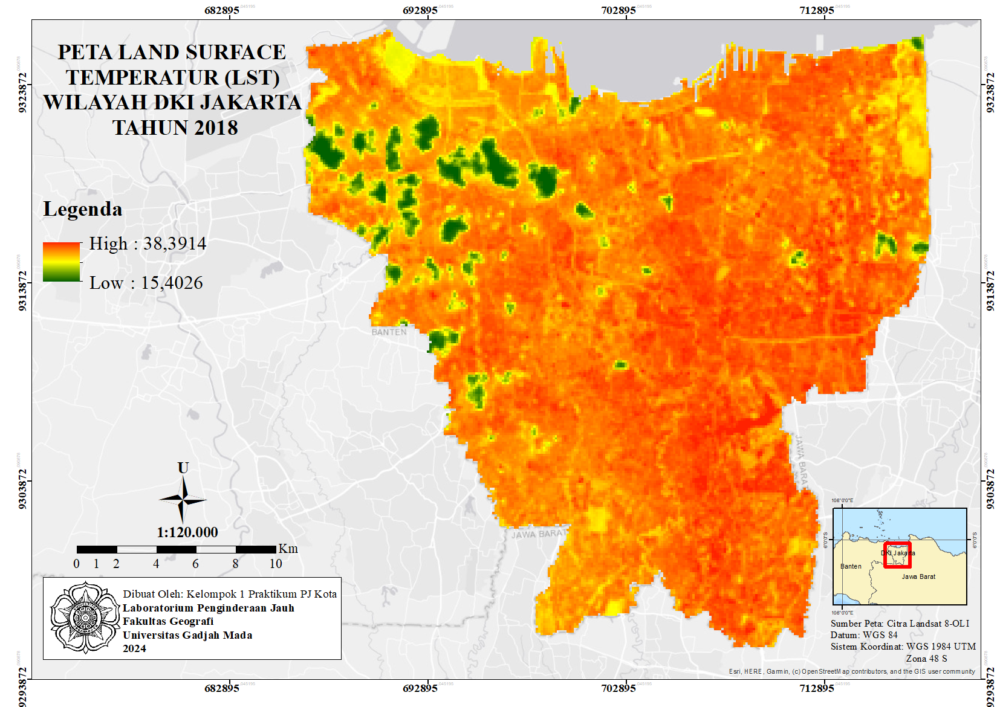
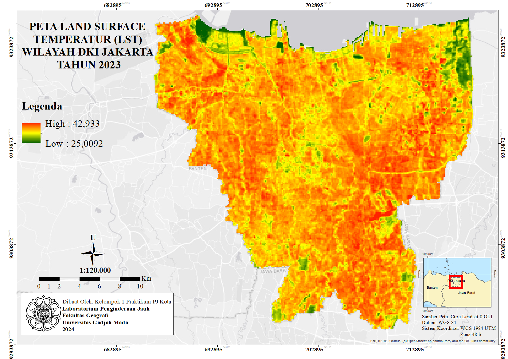

# Multitemporal Analysis of UHI in Jakarta

## Overview
This project investigates the Urban Heat Island (UHI) phenomenon by analyzing the spatiotemporal dynamics of Land Surface Temperature (LST). Using multi-temporal Landsat 8 imagery with a 5-year interval, the study monitors how urban surface temperatures have evolved. To evaluate the ecological impact of this thermal rise, the project utilizes the Urban Thermal Field Variance Index (UTFVI), which serves as a key indicator of thermal stress intensity within the urban environment.

## Objectives
- Analyze the spatiotemporal distribution of surface temperatures as an indicator of the UHI phenomenon within a 5-year interval.
- Quantify urban thermal stress through the Urban Thermal Field Variance Index (UTFVI) derived from LST values

## Study Area
Jakarta, Indonesia

## Software
- ENVI
- ArcGIS

## Methodology
The analysis was conducted using ENVI software to process multi-temporal Landsat 8 data. The workflow involved converting digital numbers into Land Surface Temperature (LST) values, providing a direct spatial representation of the UHI phenomenon. These LST results were then further processed to calculate the Urban Thermal Field Variance Index (UTFVI). This index was used to categorize the severity of thermal effects and their specific impact on urban ecological quality over the study period.

## Results
- LST Distribution of Jakarta 2018 & 2023
- UTFVI Distribution of Jakarta 2018 & 2023

## Map Preview

## Map Preview

  
  &nbsp; &nbsp;
  
   
  <em>LST Jakarta 2018 and LST Jakarta 2023</em>

## Academic Context
This project was developed as a collaborative final assignment for Urban Remote Sensing Survey Laboratory Course at Universitas Gadjah Mada.

## Author
Aisyah Nasywa Talitha (GIS and Remote Sensing Enthusiast)